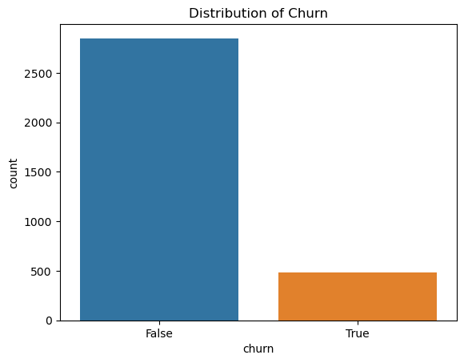
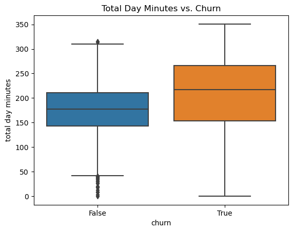
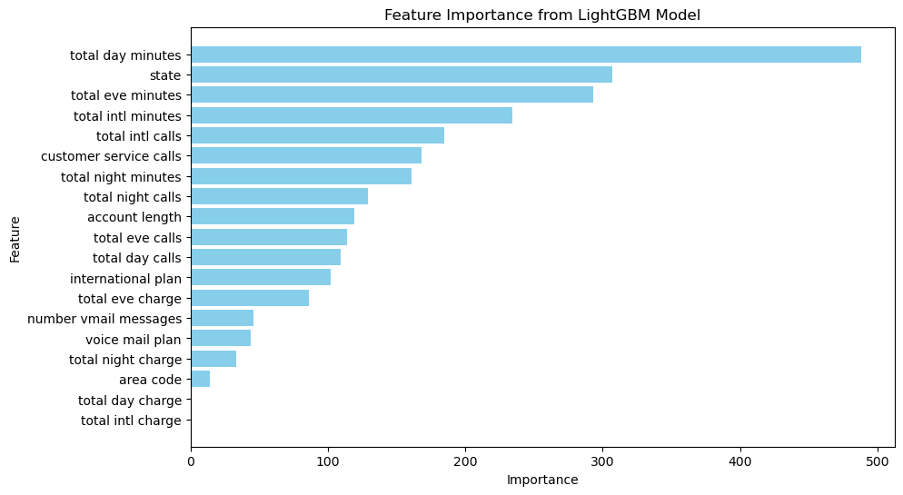

# Telecom Customer Churn Prediction Project

This project focuses on predicting customer churn for SyriaTel, a telecommunications company. By identifying customers likely to churn, the company can take proactive measures to improve retention, ultimately reducing churn rates and increasing profitability.

## Project Goals

1. **Predict customer churn** using historical customer data.
2. **Provide actionable insights** that can help reduce customer churn through targeted marketing and retention efforts.
3. **Evaluate model performance** with a focus on improving churn recall to capture more at-risk customers.

## Business Understanding

Customer churn has a significant financial impact on telecommunications companies like SyriaTel, as acquiring new customers is typically more expensive than retaining existing ones. By identifying customers at risk of churning, SyriaTel can focus on retention strategies and optimize customer engagement.

## Data Understanding

The dataset includes customer data with the following features:
- **Demographics**: Information like customer location.
- **Contract Details**: Service-related data such as international plans and customer service calls.
- **Service Usage**: Minutes and charges for day, evening, and international calls.
- **Target Variable**: Churn indicator (whether the customer has churned or not).

### Key Features
1. **Total Day Minutes**: The amount of time customers spend on calls during the day.
2. **State**: The geographic location of the customer.
3. **Total Evening Minutes**: The amount of time customers spend on calls during the evening.
4. **International Calls & Plan**: Usage and plan data related to international calls.
5. **Customer Service Calls**: Frequency of customer interactions with service representatives.

### Data Distribution

#### Churn Distribution:



This graph shows the distribution of churned vs. non-churned customers, highlighting the class imbalance, where most customers do not churn.

#### Total Day Minutes vs. Churn:



This box plot shows that customers who churn tend to have higher total day minutes compared to those who do not.

## Data Preparation

The following steps were taken to prepare the data:
1. Handling missing values and creating dummy variables for categorical features.
2. Scaling numerical features for model compatibility.
3. Separating features into categorical and numerical groups for appropriate preprocessing.

## Modeling

### 1. Baseline Model (Logistic Regression)
A simple Logistic Regression model was used as a baseline.

- **Accuracy**: 0.86
- **Precision for Churn**: 0.54
- **Recall for Churn**: 0.26
- **F1 Score for Churn**: 0.35

### 2. Hypertuned Random Forest Model
A Random Forest model was trained and hypertuned for better performance, particularly focusing on improving churn precision and recall.

- **Accuracy**: 0.94
- **Precision for Churn**: 0.91
- **Recall for Churn**: 0.63
- **F1 Score for Churn**: 0.74

### 3. Final Model: Refined LightGBM
The **LightGBM model** was chosen for its ability to handle class imbalance and improve churn recall. After hyperparameter tuning and threshold adjustments, the refined model provided the best results.

- **Accuracy**: 0.92
- **Precision for Churn**: 0.70
- **Recall for Churn**: 0.80
- **F1 Score for Churn**: 0.75

### Model Comparison:
| Model                  | Accuracy | Precision (Churn) | Recall (Churn) | F1 Score (Churn) |
|------------------------|----------|------------------|----------------|------------------|
| Logistic Regression     | 0.86     | 0.54             | 0.26           | 0.35             |
| Random Forest           | 0.94     | 0.91             | 0.63           | 0.74             |
| Refined LightGBM        | 0.92     | 0.70             | 0.80           | 0.75             |

## Feature Importance

Key features identified by the LightGBM model:
1. **Total Day Minutes**: Customers with high usage are more likely to churn.
2. **State**: Geographic location plays a significant role in churn risk.
3. **Total Evening Minutes**: Evening usage also correlates with churn.

#### Feature Importance Chart:


This chart shows the importance of various features in predicting churn. Usage patterns, such as day and evening minutes, along with customer location and customer service calls, are the most significant predictors.

## Business Recommendations

1. **Proactive Engagement with High-Usage Customers**: Focus on customers with high total day minutes by offering personalized retention plans or incentives.
2. **Geographic Targeting**: Use state-specific strategies to address churn risks based on location.
3. **Enhanced Customer Service Monitoring**: Track customers with frequent service interactions and provide timely support to reduce churn risk.

## Conclusion

The refined LightGBM model with a churn recall of 80% provides SyriaTel with an effective tool to identify at-risk customers. By focusing on key factors like usage patterns and customer service interactions, SyriaTel can take targeted actions to retain more customers and reduce churn.

## Next Steps

1. **Develop Targeted Campaigns**: Launch personalized campaigns for high-usage customers and specific geographic regions.
2. **Integrate Churn Predictions into Operations**: Embed churn predictions into SyriaTel's CRM for real-time action on high-risk customers.

## Instructions for Running the Project

1. Clone the repository:
    ```
    git clone https://github.com/nealiyer88/Telecom
    ```
2. Run the notebook to reproduce the results and insights.

---
This project demonstrates the use of machine learning to predict customer churn, providing actionable insights for customer retention strategies at SyriaTel.


